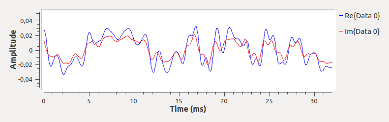
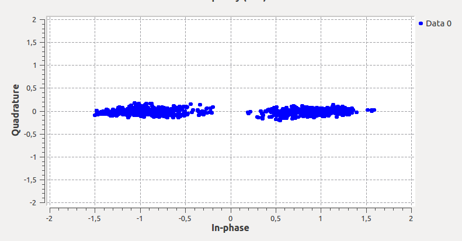

# Projeto 3

Por Pedro de la Peña e Daniel Ruhman

## Modulação Digital

### Funcionamento geral

O projeto consiste na transmissão de dados entre dois computadores por meio de da modulação de sinais pelo transmissor seguida pela desmodulação no receptor. O envio de dados é feito com base em uma caixa de texto, na qual o usuário pode escrever o que bem entender, e uma interface que exibe os dados enviados e recebidos.
A modulação e demodulação são feitas no software GNU Radio enquanto a interface foi feita em python.

#### Envio do dado

Após o usuário digitar uma mensagem na interface, o dado é enviado ao GNU Radio que, por sua vez, agrupa os bytes da mensagem e os transforma em um sinal.

#### Recepção do dado

O sinal captado pelo receptor é transformado em bytes que são reconhecidos e convertidos em strings. Caso ocorra alguma falha na transmissão, não há reenvio e o dado é perdido.

## Frequencia de transmissão e bandas utilizadas

Para o envio e receoção, foi utilizada como frequência de corte 2.2kHz, com banda igual a duas vezes a esta, ou seja, 4.4kHz.

## Modulação BPSK

A modulação BPSK é realizada alterando a fase de um sinal e mantendo sua frequência e amplitude constantes.

## Gráficos

## Transmissão

### Tempo e frequência do sinal codificado

O primeiro gráfico mostra valores que variam entre -1 e 1, enquanto o segundo é uma aplicação da transformada de Fourier no sinal desse. O ponto mais alto deste gráfico indica a frequência que mais contribuiu para a formação do sinal.

 

 

### Tempo e frequência do sinal modulado

O primeiro gráfico exibe a modulação feita por BPSK e o segundo é a aplicação da Transformada de Fourier do mesmo. Devido ao fato da aplicação da modulação BPSK alterar a fase do sinal, a transformada faz com que apareçam 2 picos (sinal espelhado no ponto x = 0).

 

 

### Gráfico de constelação

Neste diagrama são exibidos os símbolos transmitidos.

 

## Recepção

### Tempo e frequência do sinal recebido

Devido ao fato do sinal ter sido enviado em um meio não ideal, ocorreram interferências, fazendo com que o gráfico gerado permanecesse sua forma, porém com diversos ruidos ao longo de sua duração.

 

 

### Tempo e frequência do sinal demodulado

Como foi dito anteriormente, o meio de transmissão não é ideal e isto causa interferência nos gráficos. Mesmo assim, possuem o mesmo formato que os graficos dos sinais enviados

 

 

### Gráfico de constelação

Com a modulação, os pontos dos gráficos estão concentrados em -1 e 1. Tais pontos representam os polos da modulação BSKP

 

